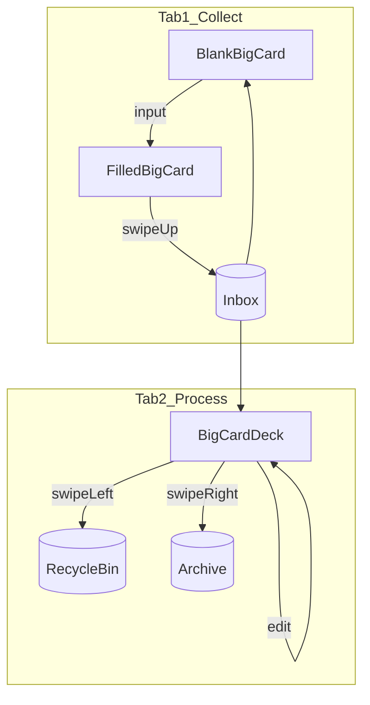
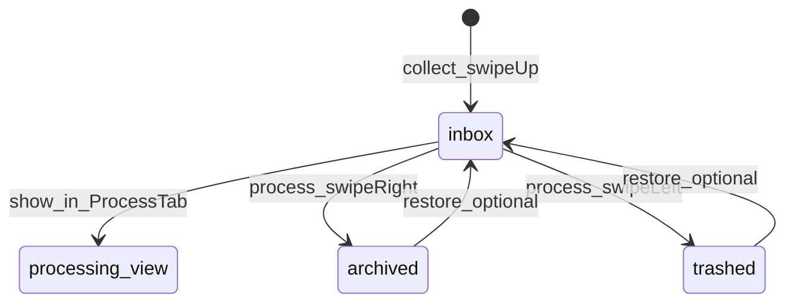
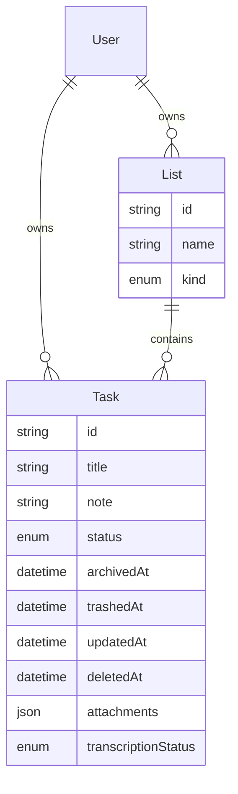
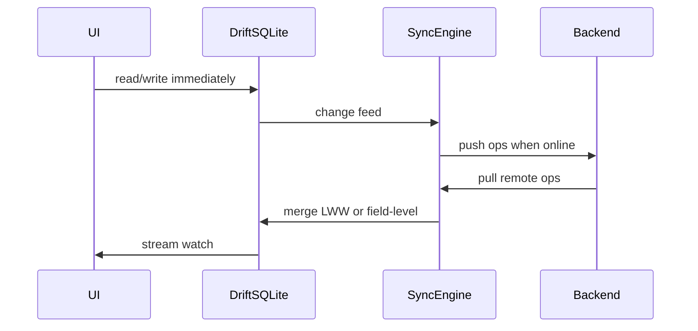

# 上瘾式跨平台 Todo — 产品讨论与实施计划

## 当前状态

仓库 [`c:\Users\kody\github_repos\todo`](c:\Users\kody\github_repos\todo) 仅有 Git 远程（`DiDongDongDi/todo`），**无应用代码**。本次讨论结论将写入 `docs/` 与根目录 `README.md`（你确认计划后由 Agent 模式创建）。

---

## 产品定位（我们要做的「简单但上瘾」）

**一句话：** 打开即写、划一下即收进收集箱、每天有一点「完成感」—— 不是功能堆砌的 GTD，而是 **3 秒内能记下一条任务** 的工具。

### 视觉与体验基调（用户已定）

- **界面简单但精致** — 少元素、大留白、 typography 与动效考究
- **动画要好** — 页面划走、任务落袋、转场回捕获页均需流畅、有「爽感」
- **打开 App 第一眼就是添加任务** — 不是列表首页，捕获优先

### 设计原则

| 原则 | 含义 |
|------|------|
| 捕获优先 | 默认 Tab 即「添加页」；所有新任务先进 **收集箱（Inbox）** |
| 多模态录入 | 文字 / 语音转文字 / 贴图 / 录音（后台自动转写） |
| 划走即提交 | 收集 Tab 录入态：整页划走 = 写入收集箱 |
| 大卡片聚焦 | 收集 / 处理 Tab 均以 **单张大卡片** 呈现任务，非传统列表 |
| 手势即命令 | 左右分拣、上下切卡；少按钮 |
| 即时反馈 | 提交、完成、删除都有动画 + 触觉（haptic） |
| 同步无感 | 离线可用，联网后自动合并；用户不感知「保存」 |
| 克制上瘾 | 用 streak、处理队列清零、轻量成就 —— 不用抽卡/广告式多巴胺 |

---

## 主导航：双 Tab 结构（用户已定稿）

| Tab | 名称 | 职责 |
|-----|------|------|
| 1 | **收集** | 空白大卡片录入；有内容时 **上划** 保存进收集箱 |
| 2 | **处理** | 收集箱内 **全部任务** 以大卡片呈现；分拣、编辑、完成 |

### Tab 栏位置（用户已定）

- **底部 Tab 栏**（`BottomNavigationBar` / 平台自适应底栏）
- 默认选中 **收集**；图标 + 短标签（「收集」「处理」）
- 大卡片区域占满 Tab 栏 **上方** 剩余空间；底部预留安全区，避免与上划保存手势冲突
- 桌面端（macOS / Windows / Web）：同样底部 Tab，或窗口较宽时保持底栏（不改为侧栏，除非后续调整）



---

## Tab 1：收集 — 用户已定稿

**定位：** 默认 Tab；**始终只有一张大卡片**，不是列表，也不是分页录入向导。

### 界面状态

```
┌─────────────────────────────┐
│                             │
│      单张大卡片（全屏主体）     │
│                             │
│  无内容：空白画布，可直接输入    │
│  · 文字                      │
│  · 语音转文字                 │
│  · 贴图                      │
│  · 录音（后台转写）            │
│                             │
├─────────────────────────────┤
│   【 收 集 】    【 处 理 】   │  ← 底部 Tab 栏
└─────────────────────────────┘
```

### 录入与保存

| 状态 | 界面 | 手势 |
|------|------|------|
| 空白 | 空白大卡片，等待输入 | 上划 **无效**（回弹 + 轻提示） |
| 有内容 | 卡片展示文字/图/音 | **上划 = 保存** → 进收集箱 |

- **上划保存后：** 卡片归空白 + **用户提示**（如轻 toast / 短文案引导「已收集，去处理页看看」）
- **不做：** 在收集页左右滑分拣（分拣放在「处理」Tab）
- **不做：** 收集页浏览历史任务（浏览在「处理」Tab）

### 录入方式（同前）

| 方式 | 落库 |
|------|------|
| 文字 | `title` / `note` |
| 语音转文字 | 文本 + 可选原音频 |
| 贴图 | `attachments`（image） |
| 纯录音 | 音频 + `transcriptionStatus` |

---

## Tab 2：处理 — 用户已定稿

**定位：** 收集箱内 **所有任务** 自动出现在此 Tab（无需手动移入）；用大卡片逐条「过堂」。

### 界面

- 同一套 **大卡片** 视觉（与收集 Tab 一致，精致、大留白）
- 一次聚焦 **一张** 任务；背后可叠下一张形成景深（可选动效）

### 手势（卡片级）

| 手势 | 行为 | 去向 |
|------|------|------|
| **左滑** | 放弃任务 | **回收站** |
| **右滑** | 完成任务 | **归档** |
| **上划 / 下划** | 切换上一条 / 下一条 | 仍在处理队列 |
| **点击 / 双击**（待定） | **编辑** 任务内容 | 仅处理 Tab 可编辑 |

- 左滑、右滑需跟手动画 + haptic；卡片飞出后露出下一张
- 支持 **撤销**（snackbar 3 秒，第二阶段亦可）

### 与 Tab 1 的分工

| | 收集 | 处理 |
|--|------|------|
| 卡片数量 | 始终 1 张 | 收集箱全部任务 |
| 上划 | 保存（有内容时） | 切下一条 |
| 下划 | — | 切上一条 |
| 左滑 | — | → 回收站 |
| 右滑 | — | → 归档 |
| 编辑 | — | ✓ |

---

## 任务状态与存储（更新）



- **`inbox`：** 收集箱；处理 Tab 展示此状态任务
- **`archived`：** 归档（右滑完成）
- **`trashed`：** 回收站（左滑放弃）；软删除，可恢复
- 处理 Tab 数据 = `WHERE status = inbox`（自动同步，无需手动移入）

**Task 模型补充字段：**

- `status`: `inbox` | `archived` | `trashed`
- `archivedAt`, `trashedAt`（便于统计与同步）
- 保留 `attachments`, `transcriptionStatus`（见前）

---

## 核心交互：桌面 / Web 映射（草案）

收集 Tab：`Enter` 保存（有内容时）；`Esc` 清空当前输入

处理 Tab：

- `←` / `→` 等价左滑 / 右滑（放弃 / 完成）
- `↑` / `↓` 切换任务
- `Enter` / 双击进入编辑

---

## 捕获页技术备注（写入 ARCHITECTURE 时展开）

- Task 模型扩展：`attachments[]`（type: image | audio）、`transcriptionStatus`（pending | done | failed）
- 语音：MVP 可用系统 STT（iOS Speech / Android SpeechRecognizer）；纯录音后台转写可接 Whisper API 或设备端模型（Phase 2+）
- 图片：本地路径 + 同步时上传 Supabase Storage

### 「上瘾」机制（建议 MVP 包含前 3 项）

1. **处理清零环** — 处理 Tab 待办完成度可视化；全部归档时短庆祝动画
2. **连续打卡 streak** — 每天至少归档 1 条或「处理队列清零」算一天
3. **完成爽感** — 处理 Tab 右滑归档：卡片飞出 + 轻震动；支持撤销（snackbar 3 秒）
4. **第二阶段：** 周回顾、轻量徽章（「连续 7 天」「单日完成 20 条」）
5. **明确不做（初期）：** 社交排行、复杂项目管理、大量设置项

---

## 共享组件：大卡片（BigTaskCard）

- 收集 / 处理两 Tab **复用同一卡片组件**，不同模式绑定不同手势
- 精致排版：大字号标题、附件预览（图缩略图 / 音频波形）、充足圆角与阴影
- 动效：`Hero` 级过渡可选；滑出方向与手势一致（上/下/左/右）

---

## 信息架构（简单数据模型）



- **`status`：** `inbox` | `archived` | `trashed`（处理 Tab 仅展示 `inbox`）
- **List `kind`（简化）：** 虚拟分区 — `inbox` / `archive` / `trash`，由 `status` 驱动，非用户自建列表
- **Attachments：** `{ type: image|audio, localPath, remoteUrl?, duration? }`
- **transcriptionStatus：** `none` | `pending` | `done` | `failed`（纯录音异步转写）
- **软删除：** `deletedAt` 便于同步与撤销
- **排序：** 每列表 `sortOrder` 浮点或整数间隙，避免全表重排

---

## 技术方案（已选：Flutter + 首日同步）

### 客户端

- **Flutter 3.x** — `android` / `ios` / `macos` / `windows` / `web`
- **状态管理：** `flutter_riverpod`（简单可测）
- **本地库：** `drift`（SQLite）— 离线真相源
- **路由：** `go_router` + `ShellRoute` 包裹底部 Tab 壳层（`Scaffold` + `NavigationBar`）
- **手势：** 自研 `BigTaskCard` + `GestureDetector`（上下切卡、左右分拣）；收集 Tab 上划保存用独立 `Dismissible` / `DraggableScrollableSheet` 式跟手动画

### 同步层（sync-first 推荐）

采用 **离线优先 + 增量同步**，避免「没网就不能用」：



**推荐组合（实现成本 vs 可靠性）：**

| 方案 | 优点 | 注意 |
|------|------|------|
| **Supabase**（Postgres + Auth + Realtime）+ 自研 sync 表 | 开源、SQL、Realtime 订阅 | 需自己写冲突合并（MVP 可用 `updatedAt` LWW） |
| **PowerSync + Supabase** | 成熟离线同步、Flutter SDK | 多一个依赖/概念 |
| **Firebase Firestore** | 同步省心 | NoSQL 建模、供应商锁定 |

**MVP 建议：** **Supabase + Drift**，同步协议用 `operations` 表（insert/update/delete + `device_id` + `version`），客户端维护 `last_sync_cursor`。若合并冲突频繁，再引入 PowerSync。

**认证：** Email magic link / OAuth（Apple、Google）— 同步前提；支持匿名试用再绑定账号（可选，降低首日摩擦）。

### 仓库结构（计划创建）

```
todo/
├── README.md
├── docs/
│   ├── PRODUCT.md      # 愿景、原则、上瘾机制
│   ├── UX-GESTURES.md  # 各平台手势与快捷键
│   ├── ARCHITECTURE.md # Flutter 模块、同步、数据表
│   └── ROADMAP.md      # 分阶段交付
├── app/                # Flutter 工程根
│   ├── lib/
│   │   ├── core/       # db, sync, auth
│   │   ├── features/
│   │   │   ├── collect/    # Tab1 收集：空白大卡片 + 上划保存
│   │   │   ├── process/    # Tab2 处理：大卡片栈 + 分拣编辑
│   │   │   ├── archive/    # 归档查看（后续 Tab 或设置入口）
│   │   │   └── trash/      # 回收站恢复
│   │   └── shared/
│   │       ├── widgets/    # BigTaskCard, swipe physics
│   └── ...
└── supabase/           # migrations, RLS policies（若选 Supabase）
```

---

## 分阶段路线图

### Phase 0 — 文档与脚手架（1–2 天）
- 写入 `docs/*`、`README.md`（本讨论固化）
- `flutter create` 多平台；`.gitignore`；基础主题（深色优先，护眼）

### Phase 1 — 本地核心（1–2 周）
- Drift 表 + Repository（status: inbox/archived/trashed + attachments）
- **共享 `BigTaskCard` 组件** + 手势物理
- **Tab 1 收集：** 空白卡片录入、上划保存、空白拦截、保存后提示
- **Tab 2 处理：** 收集箱全量卡片、上下切卡、左滑回收站、右滑归档、内联编辑
- 归档 / 回收站查看与恢复（可先放设置或次要入口）
- 多模态：文字、系统 STT、贴图、录音占位
- **尚无云：** 接口预留 `SyncRepository`

### Phase 2 — 同步与账号（1–2 周）
- Supabase Auth + `tasks` 表 + RLS + **Storage（图片/音频）**
- 后台同步；录音异步转写
- 多设备：手机收集 → 桌面处理 Tab 可见

### Phase 3 — 体验打磨（持续）
- 卡片滑出动效、haptic、撤销 snackbar
- 首次使用手势引导（处理 Tab 首卡演示左右滑）
- 桌面快捷键、Web 布局

### Phase 4 — 增强（可选）
- 提醒通知、自然语言日期（「明天下午」）
- 协作列表（若产品需要，另开设计）

---

## 关键风险与对策

| 风险 | 对策 |
|------|------|
| Flutter Web 手势/性能一般 | Web 以键鼠为主；移动为体验主战场 |
| sync-first 拖慢 MVP | Phase 1 末就定好 Drift schema 与 `sync_version` 字段；Phase 2 只接管线 |
| 「上瘾」变骚扰 | streak 可关闭；无推送轰炸；庆祝动画 < 1s |
| 各端交互不一致 | `UX-GESTURES.md` 单一真相表；共享 `TaskAction` 枚举 |

---

## 建议你现在拍板的 2 个小点（不阻塞开工，可默认）

1. **后端：** 默认 Supabase（你可之后换，但文档先按此写）
2. **语言/主题：** 中文 UI + 系统深浅色跟随

若你同意不同默认（例如 Firebase、仅英文 UI），确认计划时说明即可。

---

## 确认计划后将执行的文档动作

创建以下文件（中文），作为后续开发的「合同」：

- [`docs/PRODUCT.md`](docs/PRODUCT.md) — 双 Tab 定位、大卡片、上瘾机制
- [`docs/UX-GESTURES.md`](docs/UX-GESTURES.md) — 收集/处理手势表 + 桌面映射
- [`docs/ARCHITECTURE.md`](docs/ARCHITECTURE.md) — Flutter 分层、Drift schema、Supabase 表与同步流
- [`docs/ROADMAP.md`](docs/ROADMAP.md) — Phase 0–4 验收标准
- [`README.md`](README.md) — 项目简介与本地开发入口（Flutter 环境说明）

然后进入 Phase 0 脚手架与 Phase 1 **收集 Tab 大卡片** 首个可运行页面。
