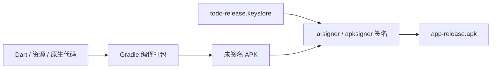

# Android APK 签名说明

> 相关：[发版流程](RELEASE.md) · [真机安装笔记](ANDROID-PHONE-INSTALL-NOTES.md)

## 一句话

**APK 签名**是用你的私钥对安装包做数字签名。Android 用它识别「这个 App 是不是同一个人发布的」，并决定是否允许覆盖安装、能否上架应用商店。

---

## 为什么需要签名？

### 1. 证明发布者身份

每个 APK 都带有一段**数字签名**（由密钥库 keystore 里的私钥生成）。手机安装时会记录：

- 包名（如 `com.todo.app.todo_app`）
- 签名指纹（谁签的名）

用户从 GitHub Release 下载的 APK，和你在 Play 商店上架的 APK，**必须是同一套密钥签名**，系统才认为是「同一个 App」。

### 2. 控制能否覆盖安装

| 情况 | 结果 |
|------|------|
| 新 APK 与已安装 App **签名相同** | 可直接覆盖升级 |
| 新 APK 与已安装 App **签名不同** | 安装失败，需先卸载旧版 |

这就是为什么本项目从「debug 签名」切到「release 签名」后，真机上若曾装过 debug 包，需要先卸载再装 release 包。

### 3. 应用商店与系统信任

- **Google Play** 要求上传用 release 密钥签名的 AAB/APK
- 部分厂商（MIUI 等）对未签名或来源不明的包有更严限制
- Android 11+ 的**按包名共享数据**、**备份恢复**等能力也与签名绑定

### 4. 防止篡改

签名后若有人改了 APK 内容，校验会失败，系统拒绝安装（或提示包损坏）。

---

## 本项目里的两套密钥

| 类型 | 用途 | 谁持有 |
|------|------|--------|
| **Debug 密钥** | `flutter run`、本地调试 | Android SDK 自动生成，每台电脑不同 |
| **Release 密钥** | GitHub Release、正式分发、上架 | 你用 `scripts/generate_android_keystore.ps1` 生成一次，**永久保管** |

Release 构建逻辑见 [`app/android/app/build.gradle.kts`](../app/android/app/build.gradle.kts)：

- 设置了环境变量 `ANDROID_KEYSTORE_PATH` 等 → 用 **release 密钥**签名
- 未设置 → 回退 **debug 密钥**（仅方便本地 `flutter build apk` 试跑）

---

## 密钥库（Keystore）里有什么？

```
todo-release.keystore
├── 私钥（绝对不能泄露、不能提交 git）
└── 证书（可导出公钥给他人验证）
```

生成命令（仓库已提供脚本）：

```powershell
powershell -ExecutionPolicy Bypass -File scripts/generate_android_keystore.ps1
```

交互式填写：

- **Keystore 密码** — 保护整个文件
- **Key 密码** — 保护密钥对（可与 keystore 密码相同）
- **Alias** — 默认 `todo-release`
- **姓名 / 组织** — 证书展示信息，个人项目可随意填

---

## 签名在构建流程中的位置



`flutter build apk --release` 最终会调用 Android Gradle 插件，在 `buildTypes.release` 里应用 `signingConfig`。

---

## 丢失密钥会怎样？

| 后果 | 说明 |
|------|------|
| 无法向已安装用户**无缝升级** | 只能换包名发新 App，或让用户卸载重装 |
| **Google Play 无法更新**同一应用条目 | 必须使用当初注册时那套上传密钥（Play App Signing 另有机制，但本地 release 密钥仍要备份） |
| GitHub Release 老用户升级失败 | 签名变了 = 新 App |

**务必备份：** `todo-release.keystore` 文件 + 两个密码，存密码管理器或离线 U 盘。

---

## CI（GitHub Actions）如何使用密钥？

不把 keystore 提交到 git，而是：

1. 本地将 keystore 转为 Base64
2. 存入 GitHub Secrets：`ANDROID_KEYSTORE_BASE64`
3. Workflow 构建前 `base64 -d` 还原为临时文件
4. 通过环境变量传给 Gradle

详见 [RELEASE.md](RELEASE.md)。

---

## 常见问题

| 问题 | 说明 |
|------|------|
| Debug 和 Release 签名能混用吗？ | 同一包名下不能覆盖安装，需卸载其一 |
| 签名和 Supabase 登录有关吗？ | **无关**。签名只影响 Android 安装与升级 |
| 需要给每个版本换新密钥吗？ | **不需要**。一套 release 密钥用到项目结束 |
| Web 需要 APK 签名吗？ | **不需要**。签名是 Android 安装包机制 |

---

## 延伸阅读

- [Android 官方：为应用签名](https://developer.android.com/studio/publish/app-signing)
- [Flutter：构建并发布 Android 应用](https://docs.flutter.dev/deployment/android)
