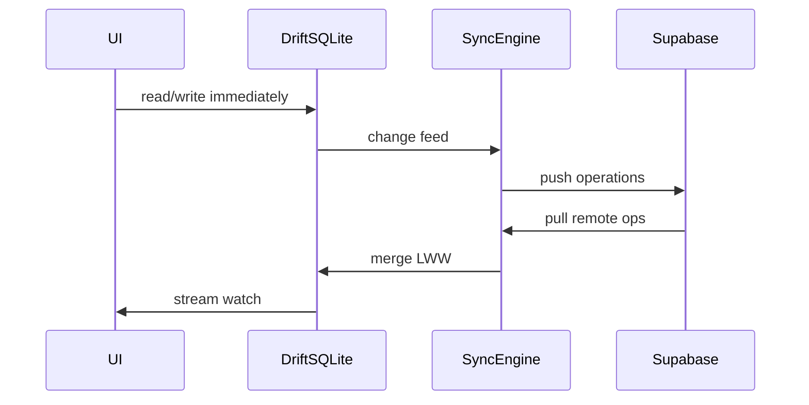

# 架构文档

## 技术栈

| 层 | 选型 |
|----|------|
| 客户端 | Flutter 3.x（Android / iOS / macOS / Windows / Web） |
| 状态管理 | flutter_riverpod |
| 本地数据库 | drift（SQLite） |
| 路由 | go_router + ShellRoute（底部 Tab 壳层） |
| 后端 | Supabase（Postgres + Auth + Storage + Realtime） |
| 同步 | 离线优先 + operations 增量同步 |

## 目录结构

```
todo/
├── docs/
├── app/                        # Flutter 工程
│   ├── lib/
│   │   ├── main.dart
│   │   ├── app.dart
│   │   ├── core/
│   │   │   ├── database/       # drift 表、DAO、迁移
│   │   │   ├── models/         # Task, Attachment 等
│   │   │   ├── repositories/   # TaskRepository
│   │   │   ├── sync/           # SyncEngine, SyncRepository
│   │   │   └── auth/           # Supabase Auth 封装
│   │   ├── features/
│   │   │   ├── shell/          # 底部 Tab 导航壳
│   │   │   ├── collect/        # Tab1 收集
│   │   │   ├── process/        # Tab2 处理
│   │   │   ├── archive/        # 归档查看
│   │   │   └── trash/          # 回收站
│   │   ├── shared/
│   │   │   ├── widgets/        # BigTaskCard, SwipeableCard
│   │   │   ├── theme/
│   │   │   └── utils/          # haptics, toast
│   │   └── router/
│   └── pubspec.yaml
└── supabase/
    └── migrations/
```

## 数据模型

### Task（本地 drift + 远端 Postgres）

| 字段 | 类型 | 说明 |
|------|------|------|
| id | UUID | 主键 |
| user_id | UUID? | 登录用户，离线匿名可为 null |
| title | TEXT | 主文本 |
| note | TEXT? | 补充说明 |
| status | ENUM | `inbox` \| `archived` \| `trashed` |
| sort_order | REAL | 排序权重 |
| attachments | JSON | `[{type, localPath, remoteUrl?, duration?}]` |
| transcription_status | ENUM | `none` \| `pending` \| `done` \| `failed` |
| archived_at | DATETIME? | |
| trashed_at | DATETIME? | |
| created_at | DATETIME | |
| updated_at | DATETIME | LWW 冲突合并 |
| deleted_at | DATETIME? | 软删除 |
| sync_version | INT | 同步版本号 |

### 状态流转

```
[*] --collect_swipeUp--> inbox
inbox --process_swipeRight--> archived
inbox --process_swipeLeft--> trashed
trashed --restore--> inbox
archived --restore--> inbox
```

处理 Tab 查询：`WHERE status = 'inbox' ORDER BY sort_order DESC, created_at DESC`

## 核心组件

### BigTaskCard

- 收集 / 处理两 Tab 复用
- 模式：`CollectMode` | `ProcessMode`
- 展示：大字号标题、多行输入、图片缩略图、音频波形占位
- 手势由外层 `SwipeableCard` 包装

### SwipeableCard

- 跟手拖拽，阈值判定
- 方向：up / down / left / right
- 回调：`onSwipeUp`, `onSwipeDown`, `onSwipeLeft`, `onSwipeRight`

## 同步架构



### operations 表（远端）

| 字段 | 说明 |
|------|------|
| id | UUID |
| user_id | 用户 |
| entity_type | `task` |
| entity_id | 任务 ID |
| op_type | `insert` \| `update` \| `delete` |
| payload | JSON 快照 |
| device_id | 设备标识 |
| created_at | 时间戳 |

客户端维护 `last_sync_cursor`，启动与联网时双向同步。

### 冲突策略

- 默认 **LWW**（`updated_at` 较新者胜）
- 同字段并发：Phase 2 可升级为字段级合并

## Supabase

### tasks 表

镜像本地 Task 字段，RLS：`user_id = auth.uid()`

### Storage

- Bucket: `attachments`
- 路径: `{user_id}/{task_id}/{filename}`
- 图片、音频上传后更新 `remoteUrl`
- RLS 与迁移：见 [SUPABASE-STORAGE-RLS.md](./SUPABASE-STORAGE-RLS.md)

### Auth

- Email magic link / OAuth（Apple、Google）
- 匿名试用 → 绑定账号（可选）

## 语音与附件

| 能力 | MVP | Phase 2 |
|------|-----|---------|
| 语音转文字 | 系统 STT | — |
| 纯录音转写 | 本地 pending 状态 | Whisper API |
| 图片 | 本地路径 | Supabase Storage 上传 |
