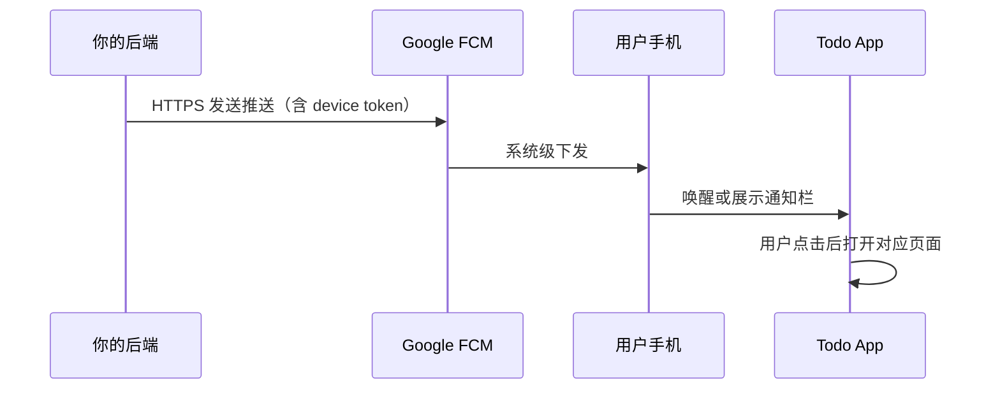

# FCM 是什么？（Firebase Cloud Messaging）

> 相关：[架构设计](ARCHITECTURE.md) · [路线图](ROADMAP.md)

## 一句话

**FCM（Firebase Cloud Messaging）** 是 Google 提供的**免费推送通知服务**。服务器或云端向 FCM 发一条消息，FCM 再把它推到用户手机上的 App（即使 App 没在运行）。

---

## 它解决什么问题？

Todo 类 App 常见需求：

| 场景 | 没有推送时 | 有 FCM 时 |
|------|------------|-----------|
| 提醒「该处理收集箱了」 | 只能靠 App 在前台或本地闹钟 | 后台也能收到系统通知 |
| 另一台设备同步了新任务 | 要等用户打开 App 才看到 | 可推送「有新任务待处理」 |
| 云端转写完成 | 用户不知道，需手动刷新 | 可通知「录音已转成文字」 |

本项目当前使用 **本地通知**（`flutter_local_notifications`）做提醒；**尚未接入 FCM**。本文说明 FCM 是什么、将来若要接入该怎么理解。

---

## 工作原理（简化）



1. **App 首次启动** — 向 FCM 注册，拿到唯一的 **Device Token**（每台设备、每个安装实例一个）
2. **你的后端** — 把 token 与用户账号绑定存库（例如在 Supabase 一张 `push_tokens` 表）
3. **要推送时** — 后端调 FCM HTTP API，带上 token 和通知内容
4. **FCM** — 负责送达、重试、与 Google Play 服务协同（国内无 GMS 的设备可能收不到）

---

## FCM vs 本地通知

| | 本地通知 | FCM 远程推送 |
|---|----------|--------------|
| 触发方 | App 本机定时器 | 你的服务器 / 云函数 |
| App 未安装 | 不适用 | 不适用 |
| App 被杀死 | 依赖系统闹钟 API，可能被省电策略延迟 | 仍可能送达（有 GMS 时） |
| 跨设备触发 | 不行 | 可以（A 设备操作 → 推给 B 设备） |
| 本项目现状 | **已用** | **未用** |

---

## 和 Firebase 其他产品的关系

FCM 属于 **Firebase** 套件，常与这些一起出现：

| 产品 | 作用 |
|------|------|
| **FCM** | 推送通知 |
| **Firebase Auth** | 登录（本项目用 **Supabase Auth**，不是 Firebase Auth） |
| **Firebase Hosting** | 静态网站托管（本项目 Web 选 **Cloudflare Pages**） |
| **Analytics** | 统计分析 |

接入 FCM **不要求**把整个后端迁到 Firebase；可以只用 FCM，数据库仍用 Supabase。

---

## Flutter 里怎么接？（将来参考）

典型步骤：

1. 在 [Firebase Console](https://console.firebase.google.com/) 创建项目，添加 Android / iOS App
2. 下载 `google-services.json`（Android）放入 `app/android/app/`
3. 添加依赖，例如 `firebase_core` + `firebase_messaging`
4. App 启动时请求通知权限，获取 token 并上传到你的后端
5. 后端（或 Supabase Edge Function）在需要时调 FCM API 发推送

伪代码示意：

```dart
// 客户端：拿到 token 后上报
final token = await FirebaseMessaging.instance.getToken();
await supabase.from('push_tokens').upsert({
  'user_id': userId,
  'token': token,
});
```

```typescript
// Edge Function：转写完成后推送
await fetch('https://fcm.googleapis.com/v1/projects/.../messages:send', {
  method: 'POST',
  headers: { Authorization: `Bearer ${accessToken}` },
  body: JSON.stringify({ message: { token: deviceToken, notification: { title: '转写完成' } } }),
});
```

---

## 成本与限制

| 项 | 说明 |
|----|------|
| 价格 | FCM 本身**免费** |
| 国内 Android | 无 Google 移动服务（GMS）的机型（部分华为等）**无法使用 FCM**，需厂商通道（华为 Push、小米 Push 等）或接受无法推送 |
| iOS | 需 Apple 推送证书 / APNs，FCM 作为转发层 |
| Web | FCM 也支持 Web Push，但需 Service Worker，与 Flutter Web 集成较繁琐 |

---

## 本项目要不要上 FCM？

**当前阶段：非必须。**

- 本地提醒、打开 App 同步已覆盖核心 Todo 流程
- 后端已是 Supabase，不是 Firebase 全家桶
- 真机推送、省电策略、国内 GMS 差异会增加维护成本

**适合接入的时机（见 [ROADMAP.md](ROADMAP.md)）：**

- 需要「云端转写完成」「协作者 @ 你」等**服务端主动通知**
- 需要多设备实时感更强的体验
- 准备上架 Play 商店并投入运营推送策略

---

## 延伸阅读

- [Firebase Cloud Messaging 官方文档](https://firebase.google.com/docs/cloud-messaging)
- [FlutterFire：firebase_messaging](https://firebase.flutter.dev/docs/messaging/overview)
